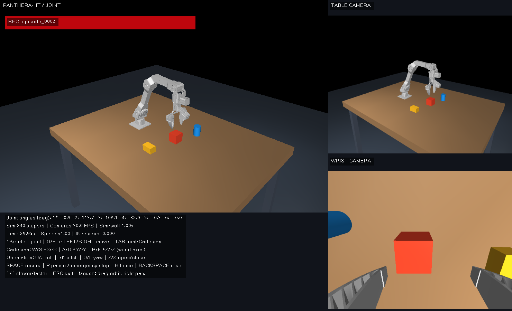

# Panthera-HT local robotics simulator

A runnable Windows desktop application for keyboard teleoperation and synchronized
demonstration collection using **HighTorque Robotics' official standard
Panthera-HT six-axis model**, including its articulated gripper and wrist camera
housing. Includes a physics-enabled table, cube, cylinder and block; a movable 3D
viewport; two 640×480 RGB views; HDF5 recording; CSV/PNG export; and trajectory
replay.



## Download and run on Windows 11

On this GitHub page, click **Code → Download ZIP** and extract it, or clone the
repository with Git. Install **64-bit Python 3.12** with the Python launcher.
Open PowerShell in the extracted `panthera-ht-simulator-main` folder (or your
cloned repository folder), then run:

```powershell
py -3.12 -m venv .venv
.\.venv\Scripts\python.exe -m pip install -r requirements.txt
.\.venv\Scripts\python.exe tools/fetch_assets.py --verify
.\.venv\Scripts\python.exe main.py
```

After setup, double-click **Launch Simulator.cmd** to run it again. `setup.ps1`
also performs the setup steps once Python is installed. No environment activation
or WSL is needed. Click the simulator window before using the keyboard. Changing
window focus automatically pauses the simulation; press **P** to resume.
The application resolves config and asset paths relative to the project/config
file, so launch does not depend on the terminal's working directory.

All necessary official meshes are bundled. To restore missing or modified
upstream assets, run `python tools/fetch_assets.py` without `--verify`; it downloads
only the pinned, checksum-verified files. Normal launch works offline.

## Why this stack

**Python 3.12 + MuJoCo 3.3.7 + GLFW + NumPy + h5py + Pillow.** MuJoCo provides fast
CPU physics, native Windows binaries, URDF import, contact dynamics, Jacobians,
and OpenGL rendering. One graphics context handles all three views. CUDA, PyTorch,
ROS, WSL and a simulator service are unnecessary. The NVIDIA GPU or the integrated
Intel GPU can render the scene; no model training runs here.

MuJoCo is a smaller fit for this single-arm collection task than adopting an
entire Isaac Sim workflow. The official RoboTwin implementation is useful as an
asset source, but its SAPIEN/CuRobo environment targets Linux and includes training
and planning dependencies that this application does not need. PyBullet is a
reasonable alternative; MuJoCo was selected and verified here for native Windows
rendering, stable contact simulation and a compact Python interface.

References: [MuJoCo Python API](https://mujoco.readthedocs.io/en/3.3.7/python.html),
[URDF/model import](https://mujoco.readthedocs.io/en/3.3.7/modeling.html),
[official RoboTwin setup](https://github.com/HighTorque-Robotics/Panthera-HT_RoboTwin).
Dependencies are pinned to the versions used for validation, rather than floating
to untested upgrades.

## Model selection and accuracy

The linked product is standard **Panthera-HT**, distinct from the shorter HT_S.
The standard SDK, digital twin, RoboTwin and HT_S descriptions were inspected
before implementation. The selected official RoboTwin model matches the standard
SDK's arm joint origins, axes, limits and tool frame, and includes the gripper.

The source URDF and STL files remain unchanged. A lossless STL-to-OBJ conversion
handles MuJoCo's STL face-count restriction; it does not simplify the meshes.
Original joint frames and inertial properties are preserved in the imported
simulation. The official `tool_link` and camera mounting link remain available.

Read [MODEL_SOURCES.md](docs/MODEL_SOURCES.md) for exact upstream commits/files,
differences between repositories, official limits, licensing, conversion details,
and every camera/home/servo assumption. MuJoCo's mesh contacts use convex hulls;
the renderer retains the full official mesh. This is a teleoperation simulator,
not a calibrated prediction of a real robot's contact forces or camera optics.

## Controls

Hold movement keys for continuous motion; release arm keys to hold position.
The gripper retains its commanded closure on release so a grasp keeps pressure.

| Key | Action |
|---|---|
| **1–6** | Select arm joint |
| **Q / E** or **Left / Right** | Decrease / increase selected joint |
| **Tab** | Switch joint / Cartesian mode |
| **W / S** | Cartesian +X / −X, world frame |
| **A / D** | Cartesian +Y / −Y, world frame |
| **R / F** | Cartesian +Z / −Z, world frame |
| **U / J** | Positive / negative rotation about world X |
| **I / K** | Positive / negative rotation about world Y |
| **O / L** | Positive / negative rotation about world Z |
| **Z / X** | Open / close gripper |
| **[ / ]** | Slower / faster, 0.125×–2× configured speed |
| **H** | Move gradually to configured work/home pose |
| **P** | Pause / emergency freeze; press again to resume |
| **Backspace** | Save current episode, reset arm and objects |
| **Space** | Start / stop recording at next synchronized camera boundary |
| **Esc** | Save current episode and exit |
| Left mouse drag / right drag / wheel | Orbit / pan / zoom main viewport |

The table and wrist cameras stay independent of the orbitable main viewport.
The UI shows mode, selected joint, measured angles, recording indicator, episode,
simulation rate, camera rate and real-time factor. **P** freezes the entire world
and logging; it does not let gravity continue while the robot is stopped.

Cartesian mode uses damped, incremental Jacobian IK. It respects source position
limits and bounds joint target speeds; difficult directions near singularities
may move slowly or leave a nonzero IK residual. There is no accumulated
unreachable pose target. It does not plan collision-free paths: use the viewport
and small motions when operating near objects and the table.

To try grasping, use Cartesian motion to align the open fingers around the cube,
lower them far enough to surround its sides, close with **X**, then lift with
**R**. Use **[** for finer motion. The automated contact test successfully lifts
the default cube without adding a constraint that attaches it to the gripper.

## Record, inspect, replay

1. Launch and position the arm.
2. Press **Space**. The red REC indicator shows the active episode.
3. Move the arm and gripper. Both camera images and state are sampled at 30 Hz;
   every control command and state is additionally stored at 120 Hz.
4. Press **Space** again. Wait for the saved message before closing the window.
5. Use the episode path below, adjusting its number:

```powershell
.\.venv\Scripts\python.exe main.py --validate datasets/episode_0001
.\.venv\Scripts\python.exe main.py --replay datasets/episode_0001
.\.venv\Scripts\python.exe main.py --export datasets/episode_0001
```

Replay shows the saved trajectory and recorded RGB by default. Add `--loop`,
`--speed 0.5`, or `--live-replay-cameras` as needed. It restores recorded arm,
gripper and object states; it does not re-simulate commands and claim identical
contact outcomes. Dataset metadata contains the complete configuration, robot
provenance, units, rates, timestamps, camera intrinsics and sample counts.

Use the episode number shown by the red recording indicator for your own
sessions. New recordings always receive an unused number. The source ZIP
excludes recordings and installed Python environments, and includes all
required official robot assets.

```text
datasets/episode_0001/
  metadata.json
  episode.h5
  export/                  # created only by --export
    metadata.json
    states.csv
    actions.csv
    control.csv
    camera_poses.csv
    table_camera/000000.png ...
    wrist_camera/000000.png ...
```

[DATA_FORMAT.md](docs/DATA_FORMAT.md) defines every array, timestamp, coordinate
convention and action alignment. Keep the 120 Hz stream when reconstructing the
actual command history. This schema can be adapted to imitation learning/VLA
training; it is not presented as a drop-in LeRobot dataset.

## Configuration

Edit `config.yaml` or use `--config path/to/config.yaml`:

- `simulation`: 240 Hz physics, 120 Hz control, 30 Hz target display rate.
- `robot`: official URDF/SRDF, base placement, simulated home, gains and damping.
  Arm limits and effort limits are read from the source URDF.
- `environment`: table and dynamic object geometry, placement and mass.
- `table_camera`: world position, look-at point, up vector, resolution, FPS, FOV.
- `wrist_camera`: official parent link, lens position/orientation offsets,
  forward/up vectors, resolution, FPS, FOV.
- `controls`: arm, Cartesian and gripper speeds, IK damping, maximum target lead.
- `logging`: dataset directory, HDF5 lossless compression and bounded writer queue.
- `ui`: window size and initial main-viewport orbit.

All arm angles are radians in config. Box sizes for dynamic objects are
**half-extents**; cylinder sizes are radius and half-height. Table size is its
full XYZ dimensions. Both camera FPS values must agree, control Hz must be a
multiple of camera FPS, and physics Hz must be a multiple of both. Invalid rate
combinations are rejected rather than silently producing drifting timestamps.

The wrist **housing** placement is official. Lens calibration and FOV are
simulation assumptions isolated in configuration; they can later be replaced
with measurements from a real camera. Home is a table-clear work pose, not a
manufacturer encoder calibration.

## Validation and performance

The Windows test suite checks:

- Official file checksums and exact preservation of mesh triangles.
- Independently computed URDF forward kinematics, limits, masses and inertias.
- Motion of each joint, release behavior, bounded commands and non-finite rejection.
- Cartesian translation, the rigid wrist-camera transform, and keyboard events.
- A real contact grasp/lift of the cube.
- 640×480 RGB, exact image/state/action timestamp alignment, episode numbering,
  CSV/PNG export, partial-session rejection, trajectory restoration and an exact
  re-render of a recorded frame.

```powershell
.\.venv\Scripts\python.exe -m pip install -r requirements-dev.txt
.\.venv\Scripts\python.exe -m pytest -q --basetemp build/test-results
```

Run a complete 10-second collection check without manually operating the GUI:

```powershell
.\.venv\Scripts\python.exe main.py --headless --seconds 10 --scripted --record --report benchmark.json
```

This creates a real episode using small joint and Cartesian test motions. Omit
`--scripted` during normal data collection. `--headless` uses a hidden OpenGL
window and still needs a functioning Windows display driver. `--unthrottled`
measures maximum throughput instead of pacing the simulation to wall time.

Two 640×480 cameras were verified at approximately **30 paired frames/s** while
recording and drawing the interface on this laptop's **Intel Arc Pro 140T**.
See [VALIDATION.md](docs/VALIDATION.md) for the final measured run and limits of
that check. The NVIDIA GPU is optional for this workload. The display target is
30 Hz, but its achieved rate can be lower while the camera/control clocks remain
correct. This is an ordinary desktop application, not a hard real-time system.

## Troubleshooting

- **Window pauses after switching apps:** intentional key-release protection.
  Click the simulator and press P. Recording uses simulation time, so a pause
  does not create duplicate samples.
- **No OpenGL window / black images:** update the GPU driver. For the NVIDIA GPU,
  Windows Settings → System → Display → Graphics → add this project's
  `.venv\Scripts\python.exe` → Options → High performance, then restart the app.
  No CUDA toolkit is required. Remote-desktop sessions may expose another renderer.
- **Camera FPS below 30:** plug in the laptop, close heavy GPU tasks, try the
  NVIDIA preference, or set both cameras to 320×240 while retaining 30 FPS.
  Frames are never silently skipped; the simulation slows and the UI shows the
  real-time factor. Lowering resolution changes the saved dataset configuration.
- **Slow disk / growing writer queue:** record to a local SSD. LZF compression is
  lossless. RGB data can still consume substantial storage; inspect a short
  episode before collecting long sessions. The writer stops on disk errors.
- **Script execution is disabled:** use the explicit Python commands above;
  PowerShell script execution policy does not affect them.
- **Python launcher missing:** install Python 3.12 with its launcher, or create
  the environment using the full path to a compatible Python interpreter.
- **Missing assets:** run `tools/fetch_assets.py`; downloads are pinned and checked.
- **Partial episode after a crash:** keep `episode.partial.h5` for inspection.
  The application deliberately refuses to replay it as a verified complete run.
- **Objects slip:** lower the fingers around the object before closing, move
  gently, and keep the closed gripper setpoint. Contact fidelity is bounded by
  convex mesh collision and configured friction, not hardware calibration.

## Project layout

```text
panthera_sim/
  main.py                  # CLI entry point
  config.yaml
  requirements.txt
  requirements-dev.txt
  setup.ps1 / run.ps1
  Launch Simulator.cmd     # double-click Windows launcher
  panthera/
    app.py                 # scheduling, UI lifecycle, record/replay commands
    config.py              # config loading and rate validation
    model.py               # official URDF import and environment assembly
    mesh.py                # lossless mesh-format conversion
    interfaces.py          # Action and RobotInterface contracts
    environment.py         # physics, bounded execution, IK and observations
    keyboard.py            # input only; replaceable by a policy
    rendering.py           # three views and camera capture
    recorder.py            # asynchronous HDF5 writer
    replay.py              # integrity checks, playback data and export
  assets/panthera/          # unchanged official files, license, provenance
  docs/                    # model audit, data format, verification, preview
  tools/fetch_assets.py
  tests/
  research/                # inspected source snapshots and development probes
  build/                   # generated import/mesh cache; recreated on launch
  datasets/                # user recordings; never overwritten
```

`SimulatedPanthera` implements a `RobotInterface`-shaped API. Keyboard input,
physics execution, rendering and logging are separate, so a policy controller,
real cameras, or a future official-SDK backend can reuse the data contracts.
No real robot control is implemented.
