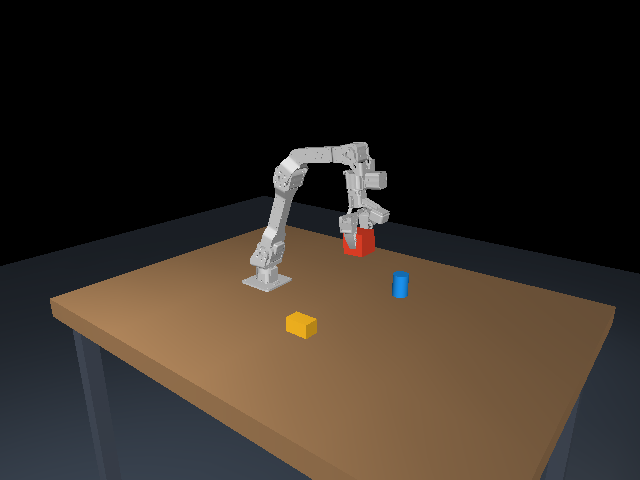

# Verification on the target Windows laptop

Completed 2026-09-23 local time / 2026-09-24 UTC.

## Functional tests

**14 tests passed**, final run in 4.71 seconds:

```text
python -m pytest -q --basetemp build/test-results
.............. [100%]
14 passed in 4.71s
```

These cover all six arm joints, held/released keys and focus loss, bounded
commands, non-finite rejection, original URDF kinematics and inertias, source
asset hashes, triangle-preserving mesh conversion, Cartesian translation,
the rigid wrist-camera mount, a contact-based grasp/lift, RGB recording,
CSV/PNG export, exact frame/control alignment, trajectory restoration, and
re-rendering a saved state to the original pixels. Package dependency checking
and Python compilation also passed.

The kinematics test independently traverses the original URDF at six random
configurations and compares all link origins/orientations. Original inertia
tensors reconstructed from the runtime's principal moments and axes agree to
an absolute tolerance of 1e-12 kg·m². The import does not auto-balance inertias.



## Sustained collection run

Command:

```powershell
.\.venv\Scripts\python.exe main.py --headless --seconds 30 --scripted --record --dataset-directory validation_runs --report research/optimized_benchmark.json --snapshot research/final_preview
```

The hidden window still rendered the complete main viewport, UI, table-camera
and wrist-camera panels during this run. Default settings used 240 Hz physics,
120 Hz control, 30 Hz camera pairs and a 30 Hz display target.

| Measurement | Result |
|---|---:|
| OpenGL renderer | Intel Arc Pro 140T GPU (32GB reported by driver) |
| Resolution per RGB camera | 640 × 480 |
| Simulated duration | 30.000 s |
| Total measured wall duration, including final save | 30.110 s |
| Paired RGB observations | 900 |
| Individual RGB images | 1,800 |
| Camera pairs / total wall second | 29.890 |
| Control samples | 3,600 |
| Physics steps | 7,200 |
| Display frames drawn | 869 |
| Median capture time for both cameras | 19.452 ms |
| 95th-percentile paired capture time | 22.131 ms |
| HDF5 episode file | 150,541,777 bytes |

The episode passed `--validate`, including exact equality between every
camera-rate state/action row and its indexed 120 Hz control row. It was then
replayed with the CLI at 15× speed. The full robot/object states were finite.
Raw measurements are in [benchmark.json](benchmark.json).

An earlier full-interface run averaged 23.9 FPS. Batching the HDF5 writes and
reducing redundant UI rendering brought the final run to the result above.
No mesh simplification, image upscaling, frame duplication or frame skipping was
used to obtain that result. The two sensors capture at exact 1/30-second
simulation intervals; wall-clock execution is approximately real time.

## What this validates

This establishes the end-to-end pipeline on the laptop's integrated Intel GPU
with the tested scene and settings. The requested NVIDIA RTX Pro 1000 Blackwell
was not selected by this OpenGL process, so no NVIDIA performance result is
claimed. A continuous visible-window session can experience different desktop
load, thermal or power conditions. The UI reports actual rates and the recorder
preserves alignment if execution slows.

Keyboard press/hold/release behavior was exercised through GLFW callback tests;
the interface itself was rendered and visually inspected. This is not a claim
that a human completed a manually keyed episode during testing. Recording and
replay were exercised with the same execution/data pipeline using scripted
test inputs.

Gripper lifting is a simulation contact test using official finger meshes and
configured friction. It does not establish real-hardware force accuracy or
camera calibration. Source-model and simulation assumptions are documented in
[MODEL_SOURCES.md](MODEL_SOURCES.md).
